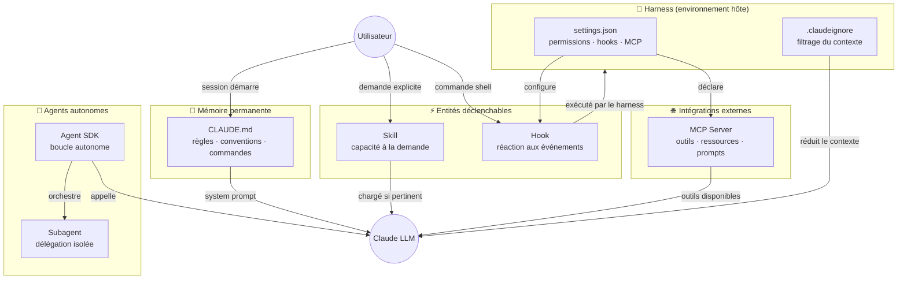
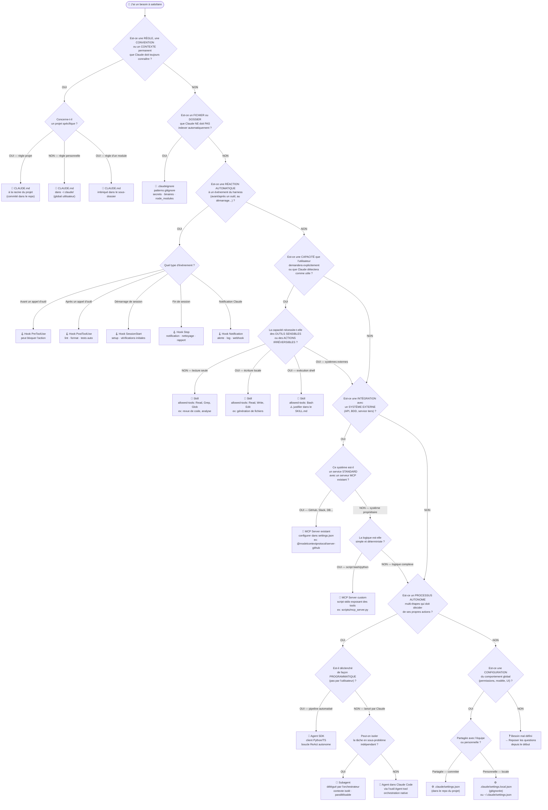

# Choisir la bonne entité Claude Code

> Schéma de décision complet pour l'ingénierie de l'écosystème Claude Code.
> Trois niveaux : vue globale → arbre de décision → matrice comparative.

---

## Niveau 1 — Vue d'ensemble de l'écosystème



---

## Niveau 2 — Arbre de décision

Posez les questions **dans l'ordre**. La première réponse OUI détermine l'entité.



---

## Niveau 3 — Matrice comparative

### Dimension 1 : Caractéristiques fondamentales


| Entité           | Qui déclenche         | Quand                        | Persiste entre sessions | Coûte des tokens        |
| ----------------- | ---------------------- | ---------------------------- | ----------------------- | ------------------------ |
| **CLAUDE.md**     | Automatique            | Toujours, dès le démarrage | ✅ Oui (fichier)        | ✅ Oui (system prompt)   |
| **.claudeignore** | Automatique            | Indexation initiale          | ✅ Oui (fichier)        | ✅ Réduit les tokens    |
| **Skill**         | Claude ou`/slash-cmd`  | À la demande, si pertinent  | ✅ Oui (fichier)        | ⚡ Seulement si activée |
| **Hook**          | Le harness             | Événement d'outil          | ✅ Oui (settings.json)  | ❌ Non (code, pas LLM)   |
| **MCP Server**    | Claude (via tool call) | Quand Claude appelle l'outil | ✅ Oui (settings.json)  | ⚡ Résultat injecté    |
| **Agent SDK**     | Code applicatif        | Programmatique               | ❌ Non (éphémère)    | ✅ Oui (chaque appel)    |
| **Subagent**      | Agent parent           | Délégation                 | ❌ Non (éphémère)    | ✅ Oui (isolé)          |
| **settings.json** | — (config)            | Au démarrage                | ✅ Oui (fichier)        | ❌ Non                   |

---

### Dimension 2 : Quoi mettre où ?


| Je veux…                                                    | Entité                         | Exemple concret                                                                  |
| ------------------------------------------------------------ | ------------------------------- | -------------------------------------------------------------------------------- |
| Que Claude connaisse toujours les conventions de mon projet  | **CLAUDE.md**                   | Format de branches, stack technique, commandes build                             |
| Que Claude ignore les gros dossiers inutiles                 | **.claudeignore**               | `node_modules/`, `data/raw/`, `*.log`                                            |
| Que Claude sache faire une revue de code structurée         | **Skill**                       | `reviewing-code-changes/SKILL.md`                                                |
| Lancer`eslint` automatiquement après chaque `Write`         | **Hook PostToolUse**            | `"matcher": "Write", "command": "eslint $CLAUDE_FILE_PATH"`                      |
| Que Claude puisse créer des PRs GitHub                      | **MCP Server**                  | `@modelcontextprotocol/server-github`                                            |
| Que Claude puisse interroger ma BDD PostgreSQL               | **MCP Server**                  | `@modelcontextprotocol/server-postgres`                                          |
| Exposer mon API interne à Claude                            | **MCP Server custom**           | `scripts/mcp_api.py` en stdio                                                    |
| Analyser 200 fichiers en parallèle sans saturer le contexte | **Subagents**                   | Orchestrateur → N subagents par module                                          |
| Déclencher une analyse de code dans un pipeline CI          | **Agent SDK**                   | Script Python avec`anthropic.Anthropic()`                                        |
| Interdire à Claude d'appeler`rm` sans confirmation          | **settings.json** (permissions) | `"deny": ["Bash(rm*)"]`                                                          |
| Recevoir une notif Slack quand Claude finit                  | **Hook Stop**                   | `"command": "curl -X POST $SLACK_WEBHOOK -d '{\"text\":\"Claude a terminé\"}'"` |
| Garder mes préférences perso (pas dans le repo)            | **settings.local.json**         | Modèle favori, couleurs, aliases                                                |

---

### Dimension 3 : Portée et visibilité

```
Portée croissante →

  Fichier          Projet            Utilisateur         Organisation
  ──────────────   ────────────────  ──────────────────  ────────────────────
  .claudeignore    .claude/          ~/.claude/          Banque de skills
  (à la racine)    settings.json     settings.json       (repo partagé)
                   commands/skill/   commands/skill/
                   CLAUDE.md         CLAUDE.md
                   (racine)          (global)
```

---

### Dimension 4 : Sécurité et blast radius


| Entité               | Peut modifier des fichiers | Peut exécuter du shell | Peut accéder au réseau | Blast radius                 |
| --------------------- | :------------------------: | :---------------------: | :----------------------: | ---------------------------- |
| **CLAUDE.md**         |             ❌             |           ❌           |            ❌            | Zéro (lecture seule)        |
| **.claudeignore**     |             ❌             |           ❌           |            ❌            | Zéro                        |
| **Skill (Read only)** |             ❌             |           ❌           |            ❌            | Zéro                        |
| **Skill (Write)**     |             ✅             |           ❌           |            ❌            | Fichiers locaux              |
| **Skill (Bash)**      |             ✅             |           ✅           |      ⚠️ Selon cmd      | Local + réseau              |
| **Hook**              |             ✅             |           ✅           |            ✅            | Illimité —**audit requis** |
| **MCP Server**        |        Selon outils        |      Selon outils      |            ✅            | Selon le serveur             |
| **Agent SDK**         |        Selon outils        |      Selon outils      |            ✅            | **Maximum** — sandboxer     |
| **Subagent**          |        Selon outils        |      Selon outils      |            ✅            | Isolé mais réel            |

> **Règle d'or** : blast radius doit être proportionnel au niveau de validation humaine.
> Hook qui supprime des fichiers → confirmation obligatoire dans le `settings.json`.

---

### Dimension 5 : Anti-patterns fréquents


| Anti-pattern                                       | Symptôme                                                                | Correction                           |
| -------------------------------------------------- | ------------------------------------------------------------------------ | ------------------------------------ |
| Mettre une règle de style dans une Skill          | La skill se déclenche pour styler alors que ça devrait être permanent | → CLAUDE.md                         |
| Mettre une logique d'intégration dans CLAUDE.md   | Claude essaie d'appeler une API sans outil dédié, hallucine les URLs   | → MCP Server                        |
| Utiliser un Agent SDK pour une tâche simple       | Sur-ingénierie, complexité inutile                                     | → Skill ou Bash direct              |
| Skill avec`allowed-tools: Bash` sans justification | Risque de sécurité non justifié                                       | → Audit + restriction               |
| Hook trop large (`matcher: ".*"`)                  | Ralentit toutes les actions, faux positifs                               | → Matcher précis (`Write`, `Bash`) |
| Un seul CLAUDE.md de 500 lignes                    | Tout est chargé à chaque requête = tokens gaspillés                  | → Déplacer dans`references/`       |
| Skill "fourre-tout" qui fait tout                  | Ne se déclenche jamais bien                                             | → Décomposer en skills focalisées |
| MCP custom pour quelque chose de natif             | `Bash` ou `Read` suffisent                                               | → Utiliser les outils natifs        |

---

## Règles mnémotechniques

```
PERMANENT   → CLAUDE.md
ÉVÉNEMENT   → Hook
DEMANDE     → Skill
EXTERNE     → MCP
AUTONOME    → Agent SDK
DÉLÉGATION  → Subagent
CONFIG      → settings.json
BRUIT       → .claudeignore
```

```
Si ça doit TOUJOURS être vrai         → CLAUDE.md
Si ça se passe QUAND quelque chose    → Hook
Si l'utilisateur le DEMANDE           → Skill
Si ça parle à un SYSTÈME TIERS        → MCP
Si ça décide TOUT SEUL en boucle      → Agent
```

---

## Cheatsheet — Questions à poser à chaque nouveau besoin

```
1. Est-ce PERMANENT ou PONCTUEL ?
   Permanent → CLAUDE.md / .claudeignore / settings.json
   Ponctuel  → Skill / Hook / MCP / Agent

2. Qui DÉCLENCHE ?
   Toujours automatique  → CLAUDE.md ou Hook
   L'utilisateur         → Skill
   Un événement d'outil  → Hook
   Claude lui-même       → MCP tool
   Du code applicatif    → Agent SDK

3. Y a-t-il un SYSTÈME EXTERNE impliqué ?
   Oui → MCP Server (existant ou custom)
   Non → Skill ou Hook suffisent

4. Est-ce AUTONOME et MULTI-ÉTAPES ?
   Oui → Agent SDK ou Subagent
   Non → Skill avec workflow

5. Quel est le BLAST RADIUS acceptable ?
   Zéro      → Skill read-only ou CLAUDE.md
   Local     → Skill avec Write/Edit
   Élevé     → Hook ou Agent SDK → validation humaine obligatoire

6. Doit-on le PARTAGER avec l'équipe ?
   Oui → .claude/commands/ ou .claude/settings.json (commité)
   Non → ~/.claude/ ou settings.local.json (ignoré)
```
